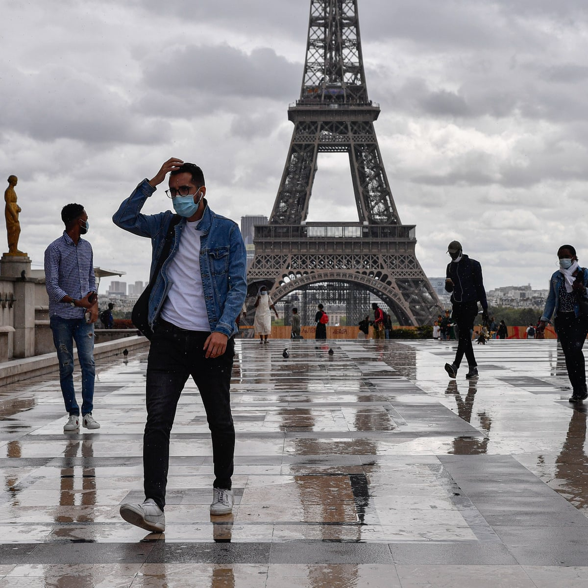

```{r setup, include=FALSE}
knitr::opts_chunk$set(echo = FALSE,  message = FALSE, warning = FALSE)
```

{width=20}

## Introduction

Have you ever heard of the lyrics: "Imagine there's no countries. It isn't hard to do." from Imagine by John Lennon. It was not that difficult to imagine under the globalization before everything since 2019. However, the world has changed since then. The Coronavirus is familiarly enouth to you all as it has affect all humankind since its outbreak. Due to the Pandemic, the borders had shut down on after another, the cities were also locked down.  What’s more, the living styles had also changed a lot. Since it has been affecting us for a long period of time and it is still existing, it is necessary for us get to know more about it and fight against the disaster together to restore the order of the world. 
This erport mainly focus on **France**

This report gievs an analysis about **covid-19** in **france**.

### Data exploration

```{r laod data}
library(dplyr)
library(tidyverse)
library(readr)
France <- read_csv("Data/France.csv")
vaccinations_by_age_group <- read_csv("Data/vaccinations-by-age-group.csv")
vaccinations <- read_csv("Data/vaccinations.csv")
```


## analysis
```{r}
vaccinations_by_age_group %>% 
  group_by(location) %>% 
  subset(location == "France") -> age_vaccinations

vaccinations %>% 
  group_by(location) %>% 
  subset(location == "France") -> vaccinations
```

### Numerical summary statistics

